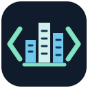
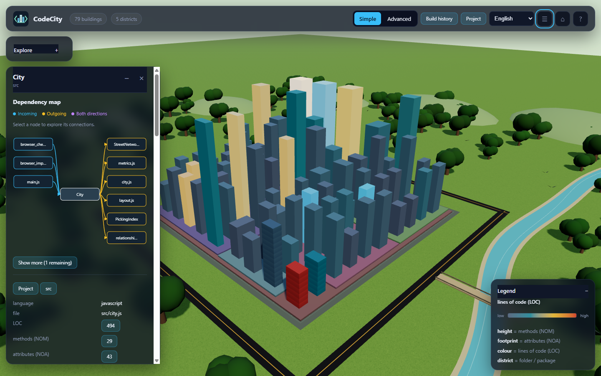

<p align="center">
  
</p>

# CodeCity

[English](README.md) · [فارسی](README.fa.md)

پروژهٔ خود را به شکل یک **شهر سه‌بعدی تعاملی** کاوش کنید. کلاس‌ها و ماژول‌ها به
ساختمان و پوشه‌ها به محله تبدیل می‌شوند. با انتخاب یک ساختمان، ساختمان‌های مرتبط
روشن می‌شوند و وابستگی‌ها در نقشه‌ای تعاملی کنار شهر نمایش داده می‌شوند.
CodeCity کد منبع را به‌صورت محلی بررسی می‌کند، بدون نصب یا اجرای کد پروژهٔ شما.



## قابلیت‌ها

- پروژه‌های چندزبانه را باز کنید: JavaScript/TypeScript، Python، C/C++، Java، C#، Go و زبان‌های دیگر.
- تعداد متدها را به ارتفاع، تعداد ویژگی‌ها را به مساحت پایه و تعداد خطوط کد را به رنگ نگاشت کنید؛ تنظیمات پیش‌فرض را تغییر دهید و ذخیره کنید.
- با انتخاب ساختمان‌ها، اعضا، وابستگی‌ها، شواهد معیارها و پیش‌نمایش کد منبع را ببینید.
- تاریخچهٔ Git را پخش کنید، ساختار کامیت‌های گذشته را ببینید و آن‌ها را با پروژهٔ فعلی مقایسه کنید.
- با حالت ساده شروع کنید؛ برای فیلترها، بررسی‌های تحلیلی و گزارش اسکن از حالت پیشرفته استفاده کنید.
- از بین هشت زبان رابط کاربری انتخاب کنید؛ فارسی و عربی چیدمان راست‌به‌چپ دارند.

نسخه‌های همراه three.js و پارسرها باعث می‌شوند برنامهٔ نصب‌شده آفلاین اجرا شود.
Git اختیاری است و برای تاریخچه لازم می‌شود. معیارها و تخمین وابستگی‌ها به بررسی
کد کمک می‌کنند؛ کیفیت کد یا کامل بودن گراف فراخوانی هنگام اجرا را اثبات نمی‌کنند.

## شروع کار

به **Node.js نسخهٔ 22.13 یا جدیدتر** نیاز دارید. از داخل نسخهٔ دریافت‌شدهٔ پروژه:

```bash
npm start
# باز کردن مستقیم یک پروژه:
npm start -- --root /path/to/project
```

برای اجرای پروژه نیازی به نصب وابستگی‌ها نیست. اجراکننده مرورگر را باز می‌کند؛
برای انتخاب پوشه به **Project → Open project** بروید. برای چرخاندن نما بکشید،
برای بزرگ‌نمایی اسکرول کنید، برای جابه‌جایی نما با دکمهٔ راست بکشید و برای دیدن
جزئیات روی ساختمان کلیک کنید.

اگر Node و npm نصب هستند، برنامه را مستقیم از GitHub اجرا کنید:

```bash
npx --yes --package=https://codeload.github.com/Amin-Tgz/CodeCity/tar.gz/refs/heads/main codecity
```

اگر Node نصب نیست، از نصب‌کنندهٔ داخل پروژه استفاده کنید:

```powershell
# Windows
powershell -NoProfile -ExecutionPolicy Bypass -File .\scripts\install.ps1
```

```bash
# macOS / Linux
sh scripts/install.sh
```

نصب‌کننده‌ها در صورت نیاز یک نسخهٔ سازگار از Node را دانلود و صحت آن را بررسی
می‌کنند. برای نصب از راه دور، گزینه‌های اجراکننده، کنترل‌ها، استثناهای اسکن،
قواعد معیارها و محدودیت‌های تحلیل، [راهنما](docs/GUIDE.md) را ببینید.

## توسعه و مستندات

```bash
npm test
# فقط هنگام به‌روزرسانی پارسرهای همراه یا پردازشگر تحلیل:
npm ci
npm run build:parsers
```

- [راهنمای کامل](docs/GUIDE.md): استفاده، معماری، بررسی‌های مرورگر و بنچمارک‌ها.
- [پژوهش](docs/RESEARCH.md): تحلیل پروژه‌های واقعی و محدودیت‌های باقی‌مانده.
- [بازبینی](docs/REVIEW.md): یافته‌های ثبت‌شده و بررسی صحت عملکرد.
- [نتایج تست سرتاسری](docs/E2E.md): تست مرورگر روی پروژه‌های عمومی.

استعارهٔ شهر برگرفته از مقالهٔ *Visualizing Software Systems as Cities* نوشتهٔ
Richard Wettel و Michele Lanza است (VISSOFT 2007).
